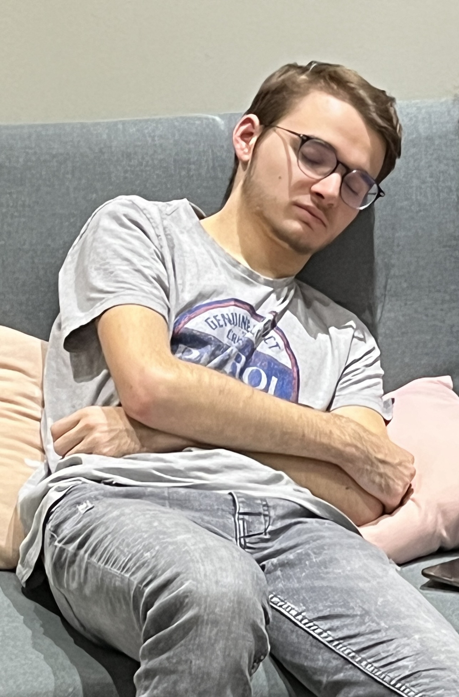

# Mon premier site GitHub

Le site de l'IUT du Havre
[Cliquez ici pour y accéder](https://www-iut.univ-lehavre.fr)

La page de Celia Antunes (Responable Controle Qualite sur viande DAUBEUF)
[Cliquez ici pour y accéder](./celia.md)

L'image de DAUBEUF

***

Image externe 

*** 

<table class="tg">
<thead>
  <tr>
	<th class="tg-0pky"></th>
	<th class="tg-0lax">En France</th>
	<th class="tg-0lax">En Belgique</th>
	<th class="tg-0lax">En Ukraine</th>
  </tr>
</thead>
<tbody>
  <tr>
	<td class="tg-266k">Nombre de vache</td>
	<td class="tg-0lax">18 Millions</td>
	<td class="tg-0lax">2,3 Millions</td>
	<td class="tg-0lax">600 000</td>
  </tr>
</tbody>
</table>

***

<iframe width="560" height="315" src="https://www.youtube.com/embed/b8HVQtIoBYU" title="YouTube video player" frameborder="0" allow="accelerometer; autoplay; clipboard-write; encrypted-media; gyroscope; picture-in-picture; web-share" allowfullscreen></iframe>

Ceci est encadré 
